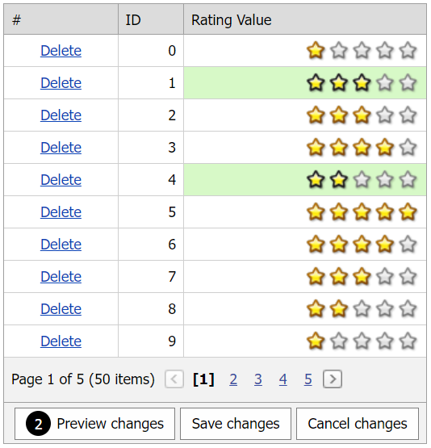

# Grid View for ASP.NET Web Forms - How to use an edit item and data item templates in batch mode
<!-- run online -->
**[[Run Online]](https://codecentral.devexpress.com/195209760/)**
<!-- run online end -->

This example demonstrates how to create a column's template, add a rating control to the template, and configure the grid's cell edit functionality in batch mode. 



## Overview:

Follow the steps below to configure the grid's edit functionality for templated cells in batch mode:

1. Create the [Grid View](https://docs.devexpress.com/AspNet/DevExpress.Web.ASPxGridView) control, set its [Mode](https://docs.devexpress.com/AspNet/DevExpress.Web.ASPxGridViewEditingSettings.Mode) property to `Batch`, and enable the [AllowRegularDataItemTemplate](https://docs.devexpress.com/AspNet/DevExpress.Web.GridBatchEditSettings.AllowRegularDataItemTemplate) property.

    ```aspx
    <dx:ASPxGridView ID="ASPxGridView1" runat="server" KeyFieldName="ID" ClientInstanceName="grid"
        DataSourceID="ObjectDataSource1">	
        <!-- ... -->
        <SettingsEditing Mode="Batch">
            <BatchEditSettings EditMode="Cell" AllowRegularDataItemTemplate="true"
            StartEditAction="FocusedCellClick" />
        </SettingsEditing>
        <ClientSideEvents BatchEditStartEditing="OnBatchEditStartEditing"
            BatchEditEndEditing="OnBatchEditEndEditing"
            FocusedCellChanging="OnFocusedCellChanging" Init="OnGridInit" />
    </dx:ASPxGridView>
    ```

2. Specify a column's [DataItemTemplate](https://docs.devexpress.com/AspNet/DevExpress.Web.GridViewDataColumn.DataItemTemplate) and [EditItemTemplate](https://docs.devexpress.com/AspNet/DevExpress.Web.GridViewDataColumn.EditItemTemplate) properties, add rating controls to the templates, and specify their `ClientInstanceName` properties.

    ```aspx
    <DataItemTemplate>
        <dx:ASPxRatingControl ID="ratingControl" runat="server"
            ClientInstanceName='<%# "DataItemRateControl"+ Container.VisibleIndex %>' 
            ItemCount="5" Value='<%# Convert.ToInt32(Eval("RatingValue")) %>'>
            <ClientSideEvents ItemClick="OnItemMouseClick_DataItem" ItemMouseOver="OnItemMouseOver_DataItem"
                ItemMouseOut="OnItemMouseOut_DataItem" />
        </dx:ASPxRatingControl>
    </DataItemTemplate>
    <EditItemTemplate>
        <dx:ASPxRatingControl ID="ratingControl" runat="server" ClientInstanceName="EditItemRateControl" ItemCount="5">
            <ClientSideEvents ItemClick="OnItemMouseClick_EditItem" Init="OnRateControlInit_EditItem" />
        </dx:ASPxRatingControl>
    </EditItemTemplate>
    ```

3. Handle the grid's client-side [BatchEditStartEditing](https://docs.devexpress.com/AspNet/js-ASPxClientGridView.BatchEditStartEditing) event to assign the edit value to the rating control. To save this value when editing ends, handle the grid's client-side [BatchEditEndEditing](https://docs.devexpress.com/AspNet/js-ASPxClientGridView.BatchEditEndEditing) event.

    ```js
    function OnBatchEditStartEditing(s, e) {
        EditItemRateControl.SetValue(e.rowValues[s.GetColumnByField("RatingValue").index].value);
    }
    function OnBatchEditEndEditing(s, e) {
        var templateColumn = s.GetColumnByField("RatingValue");
        if (!e.rowValues.hasOwnProperty(templateColumn.index))
            return;
        var cellInfo = e.rowValues[templateColumn.index];
        cellInfo.value = EditItemRateControl.GetValue();
        SetRateControlValueByRowIndex_DataItem(e.visibleIndex, cellInfo.value);
    }
    ```

4. For rating controls, handle their client-side `ItemMouseClick` events and do the following in handlers:

   * Call the grid's [EndEdit](https://docs.devexpress.com/AspNet/js-ASPxClientGridViewBatchEditApi.EndEdit) method to finish editing after a user clicks a rating control item in the edit item template.
   * Call the grid's [SetCellValue](https://docs.devexpress.com/AspNet/js-ASPxClientGridViewBatchEditApi.SetCellValue(visibleIndex-columnFieldNameOrId-value)) method to assign a new value to a rating control item in the data item template.

    ```javascript
    function OnItemMouseClick_EditItem(s, e) {
        grid.batchEditApi.EndEdit();
    }
    function OnItemMouseClick_DataItem(s, e) {
        grid.batchEditApi.SetCellValue(currentFocusedCell.itemVisibleIndex, currentFocusedCell.column.index, s.GetValue());
    }
    ```

5. To add keyboard navigation to the grid, handle the grid's client-side `Init` event and add a `KeyDown` event handler. In this handler, process key codes as follows:

    ```javascript
    function OnGridInit(s, e) {
        ASPxClientUtils.AttachEventToElement(s.GetMainElement(), "keydown", function (evt) {
            return OnKeyDown(evt, s);
        });
    }
    function OnGridViewKeyDown(evt, grid) {
        if (typeof (event) != "undefined" && event != null)
            evt = event;
        if (!grid.InCallback() && NeedProcessDocumentKeyDown(evt)) {
            if (evt.shiftKey && evt.keyCode == 9 /*Shift + tab */) {
                setTimeout(function () {
                    grid.batchEditApi.MoveFocusBackward();
                }, 0);
            } else if (evt.keyCode == 9 /*Tab key*/) {
                setTimeout(function () {
                    grid.batchEditApi.MoveFocusForward();
                }, 0);
            }
        }
    }
    ```

6. To add keboard navigation to the rating control, handle its client-side `Init` event as described in the previous step.

## Files to Review

* [Default.aspx](./CS/BatchEditEditItemAndDataItemTemplates/Default.aspx) (VB: [Default.aspx](./VB/BatchEditEditItemAndDataItemTemplates/Default.aspx))
* [Default.aspx.cs](./CS/BatchEditEditItemAndDataItemTemplates/Default.aspx.cs) (VB: [Default.aspx.vb](./VB/BatchEditEditItemAndDataItemTemplates/Default.aspx.vb))
* [BatchEditController.js](./CS/BatchEditEditItemAndDataItemTemplates/BatchEditController.js) (VB: [BatchEditController.js](./VB/BatchEditEditItemAndDataItemTemplates/BatchEditController.js))

## Documentation

* [Grid in Batch Edit Mode](https://docs.devexpress.com/AspNet/16443/components/grid-view/concepts/edit-data/batch-edit-mode)
* [Grid View Templates](https://docs.devexpress.com/AspNet/3718/components/grid-view/concepts/templates)

## More Examples

* [Grid View for ASP.NET Web Forms - How to use and modify a control placed in templated column in batch edit mode](https://github.com/DevExpress-Examples/aspxgridview-batchedit-how-to-use-and-modify-a-control-placed-in-dataitemtemplate-t506160)
